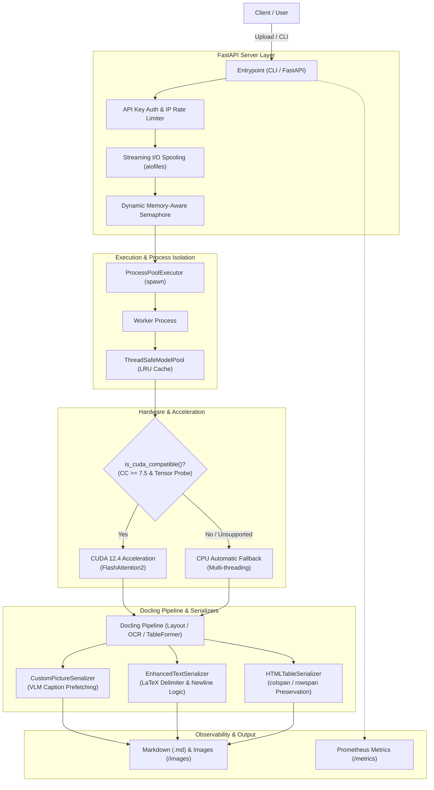

# Docling Markdown Generator

[](https://www.python.org/downloads/)
[](https://opensource.org/licenses/MIT)
[](https://fastapi.tiangolo.com)
[](https://docling-project.github.io/docling/)
[](https://pytorch.org/)

Docling（v2.x）を基盤とした、**RAG（Retrieval-Augmented Generation）およびLLM解析に最適化された構造化Markdown変換エンジン**です。
PDF、Word（DOCX）、PowerPoint（PPTX）、Excel（XLSX）、HTML等から、高精度なMarkdown、抽出画像アセット、LaTeX数式、およびHTML構造化テーブルを生成します。

本プロジェクトは、単なるラッパーを超え、エンタープライズでの本番運用に耐えうる**高並行性、耐障害性（GPU/CPU自動フォールバック）、セキュリティ多層防御、およびPrometheus観測性**を備えています。

---

## 📌 目次
1. [アーキテクチャ概要](#-アーキテクチャ概要)
2. [主な特徴](#-主な特徴)
3. [クイックスタート](#-クイックスタート)
   - [CLIでの利用](#1-cliでの利用)
   - [FastAPI サーバーでの利用 (Docker)](#2-fastapi-サーバーでの利用-docker)
   - [Pythonライブラリとしての利用](#3-pythonライブラリとしての利用)
4. [CLI オプション一覧](#-cli-オプション一覧)
5. [技術ドキュメント](#-技術ドキュメント)
6. [テストと検証](#-テストと検証)
7. [ライセンス](#-ライセンス)

---

## 🏗 アーキテクチャ概要



---

## 🌟 主な特徴

### 1. 高速並列化 & スケーラビリティ
- **ProcessPoolExecutor (`spawn`)**: PythonのGIL制約を排除し、マルチコアを活かしたマルチプロセス並列変換を実行。
- **メモリ適応型動的セマフォ (`get_dynamic_semaphore_limit`)**: `psutil` により空きRAM容量を常時追跡し、同時並列実行数を動的制御してOOMクラッシュを防止。
- **スレッドセーフ LRU モデルプール (`ThreadSafeModelPool`)**: 重いモデルインスタンスをキャッシュし、リクエストごとの無駄な初期化オーバーヘッドを完全排除。

### 2. ハードウェア自動フォールバック
- **動的GPU検証 (`is_cuda_compatible()`)**: 起動時にリアルテンソル演算を行い、Compute Capability >= 7.5 を検証。旧世代GPUや非GPU環境では**自動的かつ安全にCPUモードへフォールバック**します。

### 3. RAG最適化シリアライザー
- **LaTeX数式インテリジェント制御**: 数式の複雑さやドキュメント形式に応じたデリミタ自動選択（`$` / `$$` / `\(` / `\[`）と改行制御（`math_block_newline`）。
- **セル結合を完全再現する HTML Table**: 複雑なマトリクス表や結合セルを `colspan` / `rowspan` 付きの HTML `<table>` で保持。
- **マルチプロバイダ VLM 連携**: Ollama, OpenAI, Google Gemini, Anthropic, vLLM 等に対応し、ドキュメント内の図表に対して非同期並列で日本語キャプションを自動生成。指数バックオフ付きリトライ機能（429/503耐性）を内蔵。

### 4. セキュリティ多層防御 & 観測性
- **Path Traversal 防止**: 入出力パスおよびダウンロードIDの厳格なサンドボックス検証。
- **大容量アップロード DoS 対策**: `aiofiles` によるストリーミング保存とサイズ制限。
- **Prometheus メトリクス (`/metrics`)**: 変換成否、レイテンシ、アクティブプロセス数、VLMリトライ回数を標準公開。

---

## 🚀 クイックスタート

### 開発環境のセットアップ

```bash
# 依存関係のインストール（uvを利用）
uv sync --extra test
```

### 1. CLIでの利用

```bash
# 基本的な変換
uv run docling_converter_cli input.pdf -o ./output

# 数式ブロック改行・画像解像度を指定して変換
uv run docling_converter_cli sample.pdf -o ./output --math-block-newline true -s 2.0
```

### 2. FastAPI サーバーでの利用 (Docker)

```bash
# 1. 環境設定ファイルの作成
cp .env.example .env

# 2. コンテナのビルド & 起動
docker compose up -d --build
```
*APIサーバーは `http://localhost:8090` で待機します。*

```bash
# ドキュメント変換リクエスト
curl -X POST "http://localhost:8090/convert/" \
  -F "file=@sample.pdf" \
  -F "table_format=html" \
  -F "math_block_newline=true"

# Prometheus メトリクス確認
curl "http://localhost:8090/metrics"
```

### 3. Pythonライブラリとしての利用

```python
from pathlib import Path
from docling_lib.converter import PDFConverter, DocumentConversionOptions

options = DocumentConversionOptions(
    output_dir=Path("./output"),
    table_format="html",
    math_block_newline="auto",
    do_ocr=True,
    do_formula=True,
)

converter = PDFConverter(options=options)
result_path = converter.convert_file("sample.pdf")
print(f"Generated Markdown saved to: {result_path}")
```

---

## 🛠 CLI オプション一覧

```bash
uv run docling_converter_cli [OPTIONS] pdf_file
```

| オプション | 短縮形 | デフォルト値 | 説明 |
| :--- | :---: | :---: | :--- |
| `pdf_file` **(必須)** | - | - | 変換対象のファイル（PDF, DOCX, PPTX, XLSX, HTML, LaTeX等） |
| `--output-dir` | `-o` | `output` | 出力先ディレクトリ |
| `--image-dir` | - | `images` | 抽出画像の保存ディレクトリ名 |
| `--output-name` | `-n` | `processed_document.md` | 出力 Markdown ファイル名 |
| `--image-scale` | `-s` | `2.0` | 画像抽出解像度倍率（高画質化） |
| `--math-inline-delim`| - | `auto` | インライン数式デリミタ（`auto`, `$`, `\(` 等） |
| `--math-block-delim` | - | `auto` | ブロック数式デリミタ（`auto`, `$$`, `\[` 等） |
| `--math-block-newline`| - | `auto` | ブロック数式内の改行制御（`auto`, `true`, `false`） |

---

## 📖 技術ドキュメント

より詳細な仕様・ガイドラインは `docs/` ディレクトリを参照してください：

- **[API リファレンス (API_REFERENCE.md)](docs/API_REFERENCE.md)**: 全エンドポイント仕様、Formパラメータ、エラーコード、各種言語からの利用例。
- **[デプロイメント・ガイド (DEPLOYMENT.md)](docs/DEPLOYMENT.md)**: 環境変数一覧、本番運用、Prometheus監視設定、トラブルシューティング。
- **[テスト・品質保証ガイド (TESTING.md)](docs/TESTING.md)**: 単体テスト、実データE2E検証、Docker検証、セキュリティ回帰テスト。
- **[Markdown 出力仕様 (MARKDOWN_SPEC.md)](docs/MARKDOWN_SPEC.md)**: YAMLフロントマター、数式・テーブル・画像リンクの構造仕様。
- **[アーキテクチャと機能詳細 (FEATURES.md)](docs/FEATURES.md)**: セキュリティ、並列化、VLM非同期プレフェッチの詳細解説。
- **[GPU 加速とテスト (GPU_TESTING.md)](docs/GPU_TESTING.md)**: CUDA利用仕様、VRAM管理、自動フォールバック機構。
- **[変更履歴 (CHANGELOG.md)](CHANGELOG.md)**: バージョンごとの更新履歴。

---

## 🧪 テストと検証

```bash
# 全テストスイートの実行（360+件）
uv run pytest

# 実データによる FastAPI E2E 検証
uv run python tests/e2e_real_api_check.py

# Docker コンテナ向け E2E 検証
uv run python tests/e2e_docker_check.py
```

---

## 📄 ライセンス

本プロジェクトは **MIT License** の下で公開されています。

主要な使用ライブラリおよびライセンス：
- **docling** (v2.x): MIT License
- **docling-core**: MIT License
- **fastapi**: MIT License
- **pytorch (torch)**: BSD-3-Clause License
- **uvicorn**: BSD-3-Clause License
- **httpx**: BSD-3-Clause License
- **aiofiles**: Apache-2.0 License

