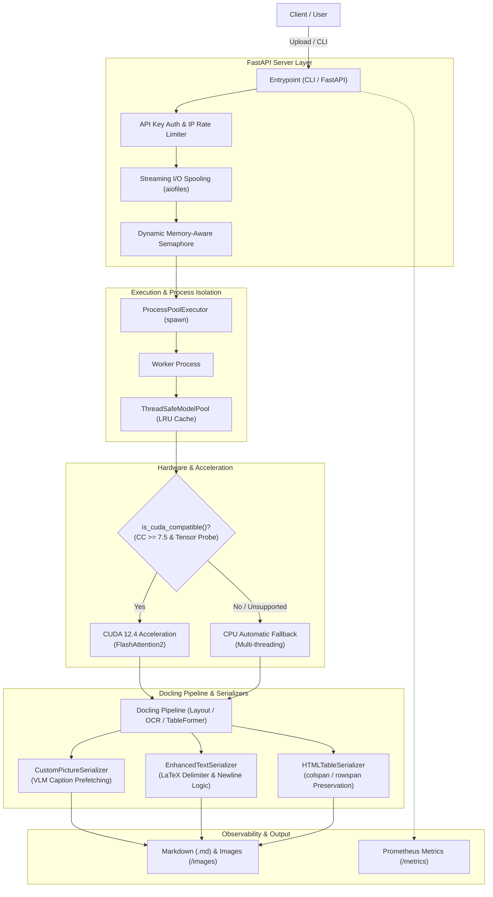

# Docling Markdown Generator

Language: [English](README_EN.md) | [日本語](README.md)

[](https://www.python.org/downloads/)
[](https://opensource.org/licenses/MIT)
[](https://fastapi.tiangolo.com)
[](https://docling-project.github.io/docling/)
[](https://pytorch.org/)

A **structured Markdown conversion engine optimized for Retrieval-Augmented Generation (RAG) and LLM analysis**, powered by Docling (v2.x).
Generates high-precision Markdown, extracted image assets, LaTeX mathematical formulas, and structured HTML tables from PDF, Word (DOCX), PowerPoint (PPTX), Excel (XLSX), HTML, and more.

Beyond a basic wrapper, this project is engineered for enterprise production environments with **high concurrency, fault tolerance (automatic GPU/CPU fallback), multi-layered security defense, and Prometheus observability**.

---

## 📌 Table of Contents
1. [Architecture Overview](#-architecture-overview)
2. [Key Features](#-key-features)
3. [Quick Start](#-quick-start)
   - [CLI Usage](#1-cli-usage)
   - [FastAPI Server (Docker)](#2-fastapi-server-docker)
   - [Python Library Usage](#3-python-library-usage)
4. [CLI Options](#-cli-options)
5. [Technical Documentation](#-technical-documentation)
6. [Testing & Verification](#-testing--verification)
7. [License](#-license)

---

## 🏗 Architecture Overview



---

## 🌟 Key Features

### 1. High Parallelism & Scalability
- **ProcessPoolExecutor (`spawn`)**: Bypasses Python's GIL to run true multi-process parallel conversions across CPU cores.
- **Dynamic Memory-Aware Semaphore (`get_dynamic_semaphore_limit`)**: Monitors free RAM via `psutil` to dynamically limit concurrency and prevent Out-of-Memory (OOM) crashes.
- **Thread-Safe LRU Model Pool (`ThreadSafeModelPool`)**: Caches heavy model instances to eliminate initialization overhead on per-request conversions.

### 2. Automatic Hardware Fallback
- **Dynamic GPU Validation (`is_cuda_compatible()`)**: Performs real tensor operation probes on startup to verify Compute Capability >= 7.5. Automatically and safely **falls back to CPU mode** on older GPU generations or CPU-only environments.

### 3. RAG-Optimized Serializers
- **Intelligent LaTeX Math Formatting**: Automatically selects delimiters (`$`, `$$`, `\(`, `\[`) and controls newline spacing (`math_block_newline`) based on formula complexity and document format.
- **HTML Tables Preserving Merged Cells**: Retains complex matrices and merged cells using HTML `<table>` elements with `colspan` and `rowspan`.
- **Multi-Provider VLM Integration**: Integrates with Ollama, OpenAI, Google Gemini, Anthropic, vLLM, etc., asynchronously prefetching Japanese/English captions for figures and diagrams with exponential backoff retries (429/503 resilient).

### 4. Multi-Layer Security & Observability
- **Path Traversal Protection**: Strict sandbox validation on input/output paths and download IDs.
- **DoS Prevention for Large Uploads**: Streaming request handling with chunk length tracking and size limits before writing to disk.
- **Prometheus Metrics (`/metrics`)**: Exposes real-time conversion success/failure rates, latencies, active processes, and VLM retry counters.

---

## 🚀 Quick Start

### Development Environment Setup

```bash
# Install dependencies using uv
uv sync --extra test
```

### 1. Pre-downloading Models (Recommended: Host-side Cache `.cache_models`)
Pre-downloading Docling models (Layout analysis, TableFormer, OCR, formula/code recognition, etc.) into the host-side `.cache_models/` folder enables **shared offline caching across local development (`uv run`), tests, and Docker containers** for fast conversion speeds.

```bash
# Download standard models to .cache_models
uv run python scripts/download_models.py

# Download all available models (including VLMs)
uv run python scripts/download_models.py --all

# Download specific models only
uv run python scripts/download_models.py -m layout tableformer rapidocr
```

### 2. CLI Usage

```bash
# Basic conversion
uv run docling_converter_cli input.pdf -o ./output

# Specify math block newline and image scale resolution
uv run docling_converter_cli sample.pdf -o ./output --math-block-newline true -s 2.0
```

### 3. FastAPI Server Usage (Docker)
The Docker environment includes **LibreOffice (headless)** and **CJK Japanese fonts (`fonts-noto-cjk`)** out of the box, fully supporting vector image conversion (EMF/WMF) and chart rendering in Office documents (DOCX, PPTX, XLSX). The host `.cache_models` folder is automatically mounted.

```bash
# 1. Create environment file
cp .env.example .env

# 2. Build & start container
docker compose up -d --build
```
*The API server will listen on `http://localhost:8090`.*

```bash
# Document conversion request
curl -X POST "http://localhost:8090/convert/" \
  -F "file=@sample.pdf" \
  -F "table_format=html" \
  -F "math_block_newline=true"

# Prometheus metrics check
curl "http://localhost:8090/metrics"
```

### 4. Python Library Usage

```python
from pathlib import Path
from docling_lib.converter import PDFConverter, DocumentConversionOptions

options = DocumentConversionOptions(
    output_dir=Path("./output"),
    table_format="html",
    math_block_newline="auto",
    do_ocr=True,
    do_formula=True,
)

converter = PDFConverter(options=options)
result_path = converter.convert_file("sample.pdf")
print(f"Generated Markdown saved to: {result_path}")
```

---

## 🛠 CLI Options

```bash
uv run docling_converter_cli [OPTIONS] pdf_file
```

| Option | Short | Default | Description |
| :--- | :---: | :---: | :--- |
| `pdf_file` **(Required)** | - | - | File to convert (PDF, DOCX, PPTX, XLSX, HTML, LaTeX, etc.) |
| `--output-dir` | `-o` | `output` | Output directory path (relative or absolute) |
| `--image-dir` | - | `images` | Directory name for extracted images |
| `--output-name` | `-n` | `processed_document.md` | Output Markdown filename |
| `--image-scale` | `-s` | `2.0` | Resolution scale factor for image extraction |
| `--table-format` | - | `html` | Table serialization format (`html` or `markdown`) |
| `--include-page-breaks` / `--no-include-page-breaks` | - | `False` | Toggle output of page break markers (`<!-- PAGE_BREAK: Page N -->`) |
| `--include-kv-extraction` / `--no-include-kv-extraction` | - | `False` | Toggle injection of Key Information section |
| `--vlm` / `--no-vlm` | - | `False` | Enable/disable VLM image caption generation |
| `--vlm-provider` | - | `ollama` | VLM provider (`ollama`, `openai`, `anthropic`, `google`) |
| `--vlm-model` | - | `qwen2-vl:2b` | VLM model name |
| `--vlm-endpoint` | - | `http://localhost:11434` | VLM service endpoint |
| `--vlm-api-key` | - | - | VLM API key (literal string, `-` for stdin, or `@path` to read from secret file) |
| `--vlm-prompt` | - | (Japanese prompt) | Prompt for VLM caption generation |
| `--vlm-max-concurrent` | - | `5` | Maximum concurrent VLM API requests |
| `--ocr` / `--no-ocr` | - | `True` | Enable/disable OCR |
| `--formula` / `--no-formula` | - | `True` | Enable/disable formula extraction |
| `--chart` / `--no-chart` | - | `False` | Enable/disable chart extraction |
| `--code` / `--no-code` | - | `False` | Enable/disable code enrichment |
| `--num-threads` | - | `4` | Number of CPU threads |
| `--cuda-flash-attention` / `--no-cuda-flash-attention` | - | `False` | Enable/disable CUDA FlashAttention2 |
| `--artifacts-path` | - | - | Path to local model artifacts directory |
| `--math-inline-delim`| - | `auto` | Inline math delimiter (`auto`, `$`, `\(` etc.) |
| `--math-block-delim` | - | `auto` | Block math delimiter (`auto`, `$$`, `\[` etc.) |
| `--math-block-newline`| - | `auto` | Math block interior newline control (`auto`, `true`, `false`) |

---

## 📖 Technical Documentation

Refer to the `docs/` directory for detailed specifications and guides:

- **[API Reference (API_REFERENCE.md)](docs/en/API_REFERENCE.md)** ([日本語](docs/API_REFERENCE.md)): Endpoint specifications, form parameters, error codes, and client code samples.
- **[Deployment Guide (DEPLOYMENT.md)](docs/en/DEPLOYMENT.md)** ([日本語](docs/DEPLOYMENT.md)): Environment variables, production best practices, Prometheus monitoring, and troubleshooting.
- **[Testing & QA Guide (TESTING.md)](docs/en/TESTING.md)** ([日本語](docs/TESTING.md)): Unit tests, real-data E2E validation, Docker verification, and security regression testing.
- **[Markdown Specification (MARKDOWN_SPEC.md)](docs/en/MARKDOWN_SPEC.md)** ([日本語](docs/MARKDOWN_SPEC.md)): YAML frontmatter, formulas, tables, and image link specifications.
- **[Architecture & Feature Details (FEATURES.md)](docs/en/FEATURES.md)** ([日本語](docs/FEATURES.md)): Security, parallel execution, and asynchronous VLM prefetching details.
- **[GPU Acceleration & Testing (GPU_TESTING.md)](docs/en/GPU_TESTING.md)** ([日本語](docs/GPU_TESTING.md)): CUDA specifications, VRAM management, and automatic fallback mechanism.
- **[Changelog (CHANGELOG.md)](CHANGELOG.md)**: Version history and update logs.

---

## 🧪 Testing and Verification

```bash
# Run full test suite (360+ tests)
uv run pytest

# Real-data FastAPI E2E verification
uv run python tests/e2e_real_api_check.py

# Docker container E2E verification
uv run python tests/e2e_docker_check.py
```

---

## 📄 License

This project is open-source under the **MIT License**.

Key dependencies and licenses:
- **docling** (v2.x): MIT License
- **docling-core**: MIT License
- **fastapi**: MIT License
- **pytorch (torch)**: BSD-3-Clause License
- **uvicorn**: BSD-3-Clause License
- **httpx**: BSD-3-Clause License
- **aiofiles**: Apache-2.0 License
